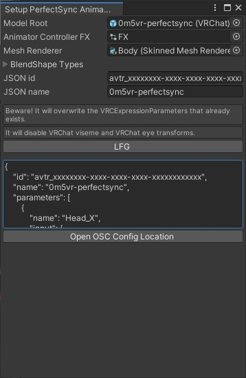

# ifm-osc-vrc

Connect between iFacialMocap and VRChat via OSC

[https://twitter.com/0b5vr/status/1494808098649030656](https://twitter.com/0b5vr/status/1494808098649030656)

> ⚠ This sucks. I just made for myself. Expect nothing.

## Prerequisite

- iPhone or iPad
  - with ARKit face tracking capability
- [iFacialMocap](https://www.ifacialmocap.com/)
- PC
  - which can emit and receive UDP
- [Node.js](https://nodejs.org/)
  - and [yarn](https://yarnpkg.com/) (`npm i -g yarn`)
- An avatar with [Perfect Sync](https://hinzka.hatenablog.com/entry/2021/12/21/222635) capability
  - [Sample VRM Model by hinzka](https://github.com/hinzka/52blendshapes-for-VRoid-face)
  - Unity blend shape names must be in camelCase format e.g. `browDownLeft`

## Converting VRM

- I recommend [VRoid Studio](https://vroid.com/studio) and [HANA_Tool](https://booth.pm/ja/items/2437978) combo
- VRM files can be imported into Unity using [UniVRM](https://github.com/vrm-c/UniVRM/releases)
- and imported VRM can be converted for VRChat uses using [VRM Converter for VRChat](https://booth.pm/ja/items/1025226)
  - Don't forget to install [VRChat SDK](https://vrchat.com/home/download/) in prior of course

## Usage

### `ifm-osc` (Node.js side)

```sh
cd ifm-osc
yarn
node index.js
```

This is completely unrelated but there are also `websocket.js` and you can test it on [my Glitch project](https://glitch.com/~three-vrm-ifm-ws)

### `osc-vrc` (Unity side)



- Put `osc-vrc/Assets/0b5vr/Editor/Scripts/SetupPerfectSync.cs` into your Unity project
- Select `0b5vr/Setup PerfectSync Animator` from menu bar (the very top of your Unity Editor window)
- Set appropriate values for each fields and click "LFG"
- Expect nothing
- If it goes smooth by any chance, copy the JSON and paste into your [OSC config file](https://docs.vrchat.com/v2022.1.1/docs/osc-avatar-parameters)
- Upload your avatar and test on VRChat

## License

[MIT](./LICENSE)
